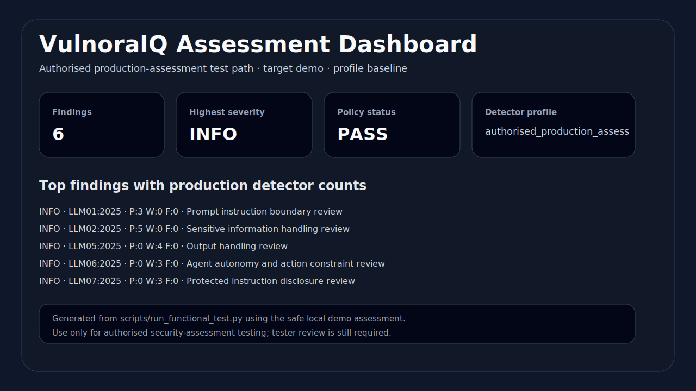

# VulnoraIQ

**VulnoraIQ** is an AI security assessment framework for **LLM applications, RAG pipelines, AI agents, tool-using systems, and orchestration layers**.

It gives security teams a structured way to run authorised AI-application assessments, collect evidence, score findings, generate reports, and track OWASP LLM / MITRE ATLAS coverage as the framework matures.

---

## Current status

**Version:** `0.2.0`  
**Deployment posture:** controlled internal enterprise production-readiness gate passed  
**Assessment assurance:** starter/framework evidence, not certified VAPT-grade assurance

| Area | Status |
| --- | --- |
| Local demo / development | Supported |
| Controlled internal enterprise deployment | Supported with production configuration validation |
| Public internet-facing deployment | Not recommended without extra controls |
| Multi-tenant SaaS hosting | Not supported |
| Certified VAPT-grade security assurance | Not claimed |

`0.2.0` may be described as:

> **Controlled internal enterprise production-readiness gate passed.**

It must **not** be described as public SaaS ready, multi-tenant ready, unsupervised internet-facing ready, or certified VAPT-grade assurance.

For details, see:

- [`docs/DEPLOYMENT.md`](docs/DEPLOYMENT.md) — deployment and production configuration
- [`docs/PRODUCTION_READINESS_SCORECARD.md`](docs/PRODUCTION_READINESS_SCORECARD.md) — scored readiness
- [`docs/PRODUCTION_HARDENING_BACKLOG.md`](docs/PRODUCTION_HARDENING_BACKLOG.md) — remaining gaps and accepted risks
- [`docs/ASSESSMENT_ASSURANCE.md`](docs/ASSESSMENT_ASSURANCE.md) — scanner/evaluator limitations
- [`SECURITY.md`](SECURITY.md) — security policy and responsible-use requirements

---

## Responsible-use boundary

Use VulnoraIQ only against systems you own or are explicitly authorised to assess.

The default `demo` target is safe and local. Configured non-demo targets require an explicit authorisation flag. Do not use this project for unauthorised scanning, credential theft, malware delivery, bypass workflows, or testing third-party systems without written permission.

---

## Dashboard example

The dashboard below is generated from the safe local functional test path and shows the intended reporting workflow.



---

## What VulnoraIQ provides today

### Assessment framework

- Safe local demo target with no external API keys.
- Baseline, RAG, agent, and full assessment profiles.
- Configured target adapters for HTTP JSON, chat-completions-compatible APIs, Ollama-style generate APIs, and webhook JSON shapes.
- Explicit authorisation gate for non-demo targets.
- Scanner, scoring, result model, policy evaluation, scoped policy exceptions, and approval evidence validation.
- Markdown, JSON, SARIF-style, Markdown dashboard, HTML dashboard, diff, trend, benchmark, and branded HTML export outputs.

### OWASP / MITRE coverage

- OWASP LLM Top 10 2025 implementation specs for all 10 categories in [`docs/owasp/`](docs/owasp/).
- Safe starter oracle coverage for all 10 OWASP LLM 2025 categories.
- Deterministic local evaluator primitives and local good/bad fixture targets.
- MITRE ATLAS AI planning matrix in [`docs/MITRE_ATLAS_AI_MATRIX.md`](docs/MITRE_ATLAS_AI_MATRIX.md).
- Source-driven ATLAS matrix generation with explicit `Unmapped / map later` backlog preservation.
- MITRE ATLAS-derived documentation tracked in [`THIRD_PARTY_NOTICES.md`](THIRD_PARTY_NOTICES.md).

### Production hardening for controlled internal deployment

- Hosted Web UI with Server-Sent Events progress updates.
- Auth enabled by default and fail-closed.
- Environment-token auth and trusted reverse-proxy identity mode.
- Role-based access: viewer, analyst, admin.
- Production-mode startup validation.
- CSRF protection for state-changing scan requests.
- Request-size limits, malformed JSON handling, and structured API errors.
- Per-IP rate limiting and scan concurrency/queue limits.
- Security headers on normal and error responses.
- Trusted proxy CIDR checks for forwarded IP and identity headers.
- SQLite job persistence by default with WAL mode, foreign keys, busy timeout, and schema versioning.
- Structured JSON audit logs with request correlation IDs.
- Auth-protected Prometheus `/metrics` endpoint by default.
- Artifact path-traversal protection and role-aware config endpoint output.
- SQLite backup/restore scripts with validation, compression, and retention support.
- Non-root Dockerfile, `/data` volume, healthcheck, Docker Compose, and `.env.production.example`.
- CI gates for Ruff, mypy, pytest, `pip check`, `pip-audit`, package metadata validation, production-readiness validation, and functional acceptance.

---

## Quick start: local demo

```bash
python -m venv .venv
source .venv/bin/activate  # Windows: .venv\Scripts\activate
pip install -e .[dev]

vulnoraiq --target demo --profile baseline
```

The demo target uses an in-memory echo client and does not call external services.

---

## Web UI: local development

```bash
vulnoraiq-web --host 127.0.0.1 --port 8787
```

Open:

```text
http://127.0.0.1:8787
```

Health checks:

```bash
curl http://127.0.0.1:8787/healthz
curl http://127.0.0.1:8787/readyz
```

Auth is enabled by default. For local development, use environment tokens or a local-only file auth configuration. Do not commit real tokens.

---

## Web UI: production-mode startup

Production mode fails closed if required controls are missing or unsafe.

```bash
export VULNORAIQ_ENV=production
export VULNORAIQ_AUTH_ENABLED=true
export VULNORAIQ_ADMIN_TOKEN="$(openssl rand -hex 32)"
export VULNORAIQ_JOB_STORE_BACKEND=sqlite
export VULNORAIQ_JOB_STORE_PATH=/data/jobs.db
export VULNORAIQ_WEB_OUTPUT_ROOT=/data/reports

python scripts/validate_runtime_production_config.py
vulnoraiq-web --host 127.0.0.1 --port 8787
```

Production validation checks include auth, admin token strength, demo-token rejection, internal dev-token disabling, SQLite backend, writable output paths, readable config paths, trusted proxy CIDRs, listen-address safety, rate-limit sanity, request-body limit sanity, CSRF TTL sanity, and audit logging configuration.

---

## Docker Compose quick start

```bash
cp .env.production.example .env.production
# Edit .env.production and replace all placeholder tokens.
docker compose up --build
```

The container path uses:

- non-root runtime user
- `/data` volume for SQLite and reports
- `/healthz` healthcheck
- production env template with placeholders only

Never commit a real `.env.production` file.

---

## Authentication modes

### Token mode, default

```bash
export VULNORAIQ_AUTH_MODE=token
export VULNORAIQ_ADMIN_TOKEN="$(openssl rand -hex 32)"
export VULNORAIQ_ANALYST_TOKEN="$(openssl rand -hex 32)"
export VULNORAIQ_VIEWER_TOKEN="$(openssl rand -hex 32)"
```

Clients pass tokens using:

```text
X-VulnoraIQ-Token: <token>
```

### Trusted reverse-proxy identity mode

Use only when a trusted upstream proxy authenticates users and strips spoofed identity headers.

```bash
export VULNORAIQ_AUTH_MODE=trusted_proxy
export VULNORAIQ_TRUST_PROXY_HEADERS=true
export VULNORAIQ_TRUSTED_PROXY_CIDRS="127.0.0.1/32,::1/128"
```

Supported identity headers:

| Header | Purpose |
| --- | --- |
| `X-Authenticated-User` | username |
| `X-Authenticated-Email` | informational email |
| `X-Authenticated-Groups` | informational groups |
| `X-VulnoraIQ-Role` | `viewer`, `analyst`, or `admin`; unknown roles default to viewer |

---

## Running authorised scans

### Safe demo scan

```bash
vulnoraiq \
  --target demo \
  --profile baseline \
  --output reports/output/demo-report.md \
  --json-output reports/output/demo-report.json \
  --sarif-output reports/output/demo-report.sarif \
  --dashboard-output reports/output/demo-dashboard.md \
  --html-dashboard-output reports/output/demo-dashboard.html
```

### Configured target scan

Only use this against systems you own or are explicitly authorised to assess:

```bash
vulnoraiq \
  --target custom_http_agent \
  --profile baseline \
  --authorised
```

Before running against a configured target:

1. Confirm written authorisation.
2. Replace placeholder endpoints in `config/targets.yaml`.
3. Validate target contracts.
4. Set any required target token environment variables.
5. Treat findings as framework evidence requiring human review.

---

## Functional acceptance and release gates

Run the functional test and refresh the dashboard example:

```bash
vulnoraiq-functional-test \
  --output-dir reports/output/functional-test \
  --screenshot docs/assets/vulnoraiq-dashboard-example.svg
```

Run local quality and readiness gates:

```bash
ruff check .
mypy .
pytest -q
python -m pip check
pip-audit
python scripts/validate_package_metadata.py
python scripts/validate_production_testing_readiness.py
python scripts/validate_runtime_production_config.py
python scripts/validate_production_testing_readiness.py \
  --run-functional \
  --output-dir reports/output/production-readiness \
  --screenshot docs/assets/vulnoraiq-dashboard-example.svg
```

If Docker is available:

```bash
docker build -t vulnoraiq:0.2.0-rc .
python scripts/container_smoke_test.py
```

---

## Backup and restore

Create a validated compressed SQLite backup:

```bash
python scripts/backup_sqlite_store.py \
  /data/jobs.db \
  /data/backups/jobs-$(date +%Y%m%d-%H%M%S).db \
  --compress \
  --validate \
  --retention 90
```

Restore a compressed backup:

```bash
python scripts/restore_sqlite_store.py \
  /data/backups/jobs-YYYYMMDD-HHMMSS.db.gz \
  /data/jobs.db \
  --compressed \
  --validate
```

---

## Repository structure

```text
vulnoraiq/
├── .github/workflows/       # CI, quality gates, dependency audit, ATLAS refresh validation
├── agent_testing/           # Agent runtime and execution validation
├── benchmarks/              # Regression benchmark suite and fixtures
├── config/                  # Targets, profiles, policies, manifests, mappings, auth, branding
├── core/                    # Scanner, scoring, policy, evidence, evaluators, results model
├── dashboards/              # Markdown, HTML, and diff-trend dashboard generation
├── docs/                    # Deployment, runbook, assurance, readiness, OWASP, MITRE docs
├── examples/                # Safe local demo targets and OWASP fixtures
├── integrations/            # Demo, HTTP JSON, chat, Ollama, webhook adapters
├── modules/                 # Assessment module protocol, registry, starter modules
├── payloads/                # Safe payload schemas and libraries
├── rag_testing/             # RAG corpus and retrieval validation
├── reports/                 # Markdown, JSON, SARIF, diff, trend, HTML export generation
├── scripts/                 # Validation, backup/restore, release, ATLAS, functional test tools
├── tests/                   # Unit and production-hardening regression tests
├── webui/                   # Hosted Web UI, auth, production checks, SQLite job store, static frontend
├── docker-compose.yml       # Production-like local deployment example
├── Dockerfile               # Non-root container image
├── SECURITY.md              # Security policy
└── THIRD_PARTY_NOTICES.md   # Third-party attribution and MITRE ATLAS notices
```

---

## Documentation map

| Need | Document |
| --- | --- |
| Documentation index | [`docs/README.md`](docs/README.md) |
| Deployment and environment variables | [`docs/DEPLOYMENT.md`](docs/DEPLOYMENT.md) |
| Operations runbook | [`docs/RUNBOOK.md`](docs/RUNBOOK.md) |
| Incident response | [`docs/INCIDENT_RESPONSE.md`](docs/INCIDENT_RESPONSE.md) |
| Release process | [`docs/RELEASE_CHECKLIST.md`](docs/RELEASE_CHECKLIST.md) |
| Migration from `0.0.1.x` to `0.2.0` | [`docs/MIGRATION.md`](docs/MIGRATION.md) |
| Readiness scorecard | [`docs/PRODUCTION_READINESS_SCORECARD.md`](docs/PRODUCTION_READINESS_SCORECARD.md) |
| Hardening backlog | [`docs/PRODUCTION_HARDENING_BACKLOG.md`](docs/PRODUCTION_HARDENING_BACKLOG.md) |
| Assessment assurance limits | [`docs/ASSESSMENT_ASSURANCE.md`](docs/ASSESSMENT_ASSURANCE.md) |
| Implementation status | [`docs/IMPLEMENTATION_STATUS.md`](docs/IMPLEMENTATION_STATUS.md) |
| OWASP LLM 2025 specs | [`docs/owasp/`](docs/owasp/) |
| MITRE ATLAS AI matrix | [`docs/MITRE_ATLAS_AI_MATRIX.md`](docs/MITRE_ATLAS_AI_MATRIX.md) |

---

## OWASP LLM 2025 starter coverage

| OWASP ID | Risk | Current module status |
| --- | --- | --- |
| LLM01:2025 | Prompt Injection | Working-alpha spec + safe oracle + local fixture |
| LLM02:2025 | Sensitive Information Disclosure | Working-alpha spec + safe oracle + local fixture |
| LLM03:2025 | Supply Chain | Working-alpha spec + safe oracle + local fixture |
| LLM04:2025 | Data and Model Poisoning | Working-alpha spec + safe oracle + local fixture |
| LLM05:2025 | Improper Output Handling | Working-alpha spec + safe oracle + local fixture |
| LLM06:2025 | Excessive Agency | Working-alpha spec + safe oracle + local fixture |
| LLM07:2025 | System Prompt Leakage | Working-alpha spec + safe oracle + local fixture |
| LLM08:2025 | Vector and Embedding Weaknesses | Working-alpha spec + safe oracle + local fixture |
| LLM09:2025 | Misinformation | Working-alpha spec + safe oracle + local fixture |
| LLM10:2025 | Unbounded Consumption | Working-alpha spec + safe oracle + local fixture |

---

## MITRE ATLAS planning matrix

Use [`docs/MITRE_ATLAS_AI_MATRIX.md`](docs/MITRE_ATLAS_AI_MATRIX.md) as the planning register for ATLAS tactics, techniques, and sub-techniques.

Regenerate from the MITRE ATLAS data source:

```bash
vulnoraiq-generate-atlas-matrix \
  --source https://raw.githubusercontent.com/mitre-atlas/atlas-data/main/dist/v6/ATLAS-2026.05.yaml \
  --output docs/MITRE_ATLAS_AI_MATRIX.md
```

If a technique cannot be confidently mapped, it remains listed as `Unmapped / map later`.

---

## Design principles

1. Safe local demo first.
2. Authorised testing only.
3. Fail closed in production mode.
4. Audit-friendly by default.
5. Clear separation between deployment readiness and assessment assurance.
6. Starter coverage should be labelled honestly until validated against real targets.
7. Public/SaaS claims must not be made until tenant isolation, HA, WAF/CDN/DDoS, OIDC/SSO, and external security testing exist.

---

## Roadmap

Next engineering priorities:

- deeper OWASP category logic and evaluator thresholds
- richer real-world fixtures and benchmark targets
- native OIDC/JWT validation
- distributed rate limiting and shared CSRF/session state
- PostgreSQL or another HA persistence backend for multi-instance deployments
- WAF/CDN/DDoS deployment guidance
- tenant isolation model for SaaS
- independent penetration test of the Web UI and assessment engine
- report language maturity review for external assurance use

---

## License and third-party notices

VulnoraIQ-specific source code and documentation are licensed under this repository's license. See [`LICENSE`](LICENSE).

Some documentation and planning data is derived from MITRE ATLAS. MITRE ATLAS data is copyright 2021-2026 MITRE and licensed under the Apache License, Version 2.0. See [`THIRD_PARTY_NOTICES.md`](THIRD_PARTY_NOTICES.md).